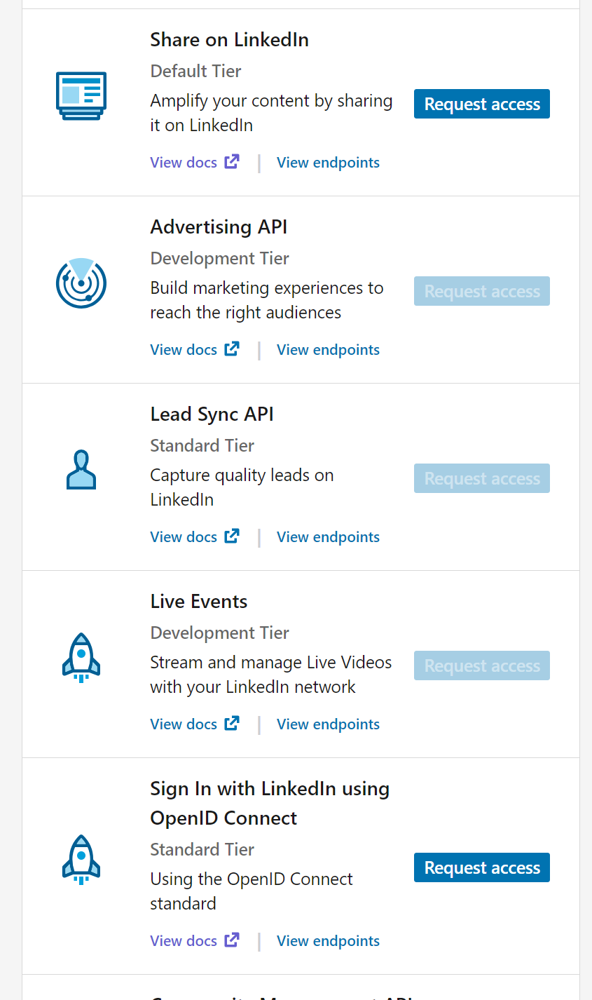
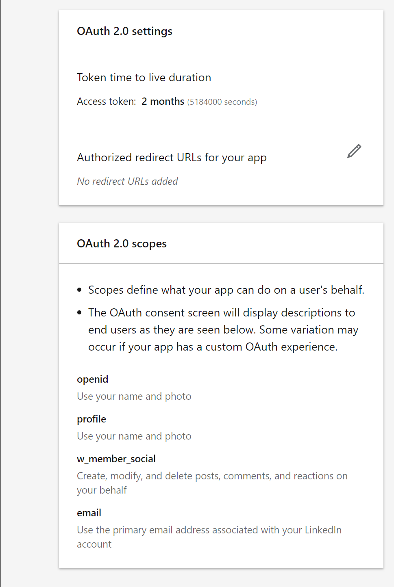

# Welcome to Automedia!!

## This application makes it easy to advertise each and everything, from advertising an open position in a big organization to advertising a product this application makes it possible to advertise it all over social media through one main account in each social media.
At this point this application takes in a prompt about the advertisement and an image related to it, it then drafts a message based on the prompt and then posts it on instagram and linkedin.

# To try this application obviously you would need to have an Instagram account and a LinkedIn account on your local machine a few steps have to be followed - 

Step - 1: clone this repository into your local machine. Install all the extensions in requirements.txt using the command - "pip install -r requirements.txt"

Note - In order to link your linkedin account, you have to use linkedin developer solutions which is rocket science atleast for me as it was not straight forward, However the good news is I went through it and I will be making it easy for you. [LinkedIn Developer Solutions](https://developer.linkedin.com/)

step 2.1 - Go ahead and create an app in linkedin developer solutions. Fill in your details, make sure you have a business page if not create one and proceed.

Now, let's request access for 'Share on LinkedIn' and 'Sign In with LinkedIn using OpenID Connect'

step 2.2 - let's get our application verified, go to settings on the nav bar and click on 'Verify' and follow the steps to get verified. After that refresh the page and check if your application is verified or not.

step 2.3 - Go to Auth on the nav bar and make sure you have the following scopes in your application as well.

While you are on that page make sure to note down your 'Client ID' and 'primary Client Secret', you will need them to access their API :).

### Now let's get into some Authentication and Authorization.

Step 3.1 - In the Auth web page, lets add an Authorized redirect URL for the local testing of this application, we can use 'http://localhost:8080' as a redeirect url for now.

Step 3.2 - Lets go ahead and open a new tab and paste this url - 'https://www.linkedin.com/oauth/v2/authorization?response_type=code&client_id={your_client_id}&redirect_uri={your_callback_url}&state=foobar&scope=openid profile w_member_social email'

make sure to replace your client id and redirect url.

This will take you to your linkedin login page and asks you if you want to share the information with the app. So, lets say Allow. Once you do that you will get to another page which most probably says "This site can't be reached" which means we are on the right road. now lets take a look at the url, we have a code, it is a long alpha-numerical-specialchars string, let's copy that and keep it. Be careful when you do so because we do not want the part '&state=foobar'

Now we have a client_id, client_secret and code.

Step 3.3 - lets exchange this code for an access token. For this I personally recommend to use postman, lets open postman and create a new POST request to 'https://www.linkedin.com/oauth/v2/accessToken'. 

Let's add a header of 'Content-Type: application/x-www-form-urlencoded'

Now, for the parameters we have -
grant_type=authorization_code
code={code_from_step2_response}
client_id={your_client_id}
client_secret={your_client_secret}
redirect_uri=http://localhost:8080

make sure to do this fast or your code might get expired and you have to get the code again using the same process.

when we successfully do it we get the access token, lets note that down as well.

step 3.4 - Now lets use this token to get our personal urn which is used to post.
lets go ahead and make another request which will be a GET request to 'https://api.linkedin.com/v2/userinfo'

Now lets hit up the authorization part of the request and select OAuth 2.0 and put in the token we got and send the request, we should now get a response and the value of the key 'sub' is you URN.

here we are done with LinkedIn.

For instagram I have a youtube video which can be followed to get all the above stuff but would be easier for instagram. [instagram API easy tutorial](https://www.youtube.com/watch?v=BuF9g9_QC04&list=LL&index=2)

